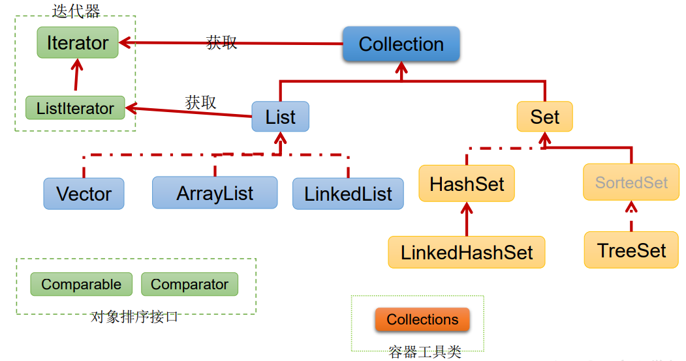

在Java中，Collection（集合）是一种用于存储和操作对象的容器类。提供一组接口和类，用于存储、检索、操作和传输数据。

Java中的集合框架位于`java.util`包中，是Java编程中最常用的一部分之一。

Collection框架提供了多种类型的集合，包括List、Set、Queue和Map等，每种集合类型都有不同的特性和用途。

## Collection接口

Collection接口是Java集合框架的根接口，它定义了对集合进行基本操作的方法。常用的方法包括添加元素、删除元素、判断元素是否存在、获取集合大小等。

常见的Collection接口的子接口和实现类包括：

- **List接口：** 有序集合，可以包含重复元素。常见的实现类有ArrayList、LinkedList、Vector等。
- **Set接口：** 无序集合，不允许包含重复元素。常见的实现类有HashSet、TreeSet等。
- **Queue接口：** 队列，通常用于存储按照一定规则排序的元素。常见的实现类有PriorityQueue、LinkedList等。
- **Map接口：** 键值对映射集合，每个元素都包含一个键和一个值。常见的实现类有HashMap、TreeMap、LinkedHashMap等。

## Collection接口方法

`Collection` 接口是 Java 集合框架中的根接口，它定义了对集合进行操作的基本方法。这些方法可以用于添加、删除、查询集合中的元素，以及获取集合的大小等操作。下面是 `Collection` 接口中常用的方法：

- **boolean add(E e):** 将指定的元素添加到集合中。如果集合被修改成功，则返回 `true`；否则返回 `false`。

- **boolean addAll(Collection< ? extends E> c):** 将指定集合中的所有元素添加到当前集合中。如果当前集合因此操作而改变，则返回 `true`。

- **void clear():** 清空集合中的所有元素，使其变为空集合。

- **boolean contains(Object o):** 判断集合中是否包含指定的元素。如果包含，则返回 `true`；否则返回 `false`。

- **boolean containsAll(Collection< ?> c):** 判断集合中是否包含指定集合中的所有元素。如果包含，则返回 `true`；否则返回 `false`。

- **boolean isEmpty():** 判断集合是否为空。如果集合不包含任何元素，则返回 `true`；否则返回 `false`。

- **Iterator< E> iterator():** 返回在集合上进行迭代的迭代器。

- **boolean remove(Object o):** 从集合中删除指定元素的一个实例（如果存在）。如果删除成功，则返回 `true`；否则返回 `false`。

- **boolean removeAll(Collection< ?> c):** 删除集合中与指定集合中包含的元素相同的所有元素。如果当前集合因此操作而改变，则返回 `true`。

- **boolean retainAll(Collection< ?> c):** 保留集合中与指定集合中包含的元素相同的元素，而删除其他所有元素。如果当前集合因此操作而改变，则返回 `true`。

- **int size():** 返回集合中的元素个数。

- **Object[] toArray():** 将集合中的元素转换为一个数组，返回的数组包含了集合中的所有元素。

- **< T> T[] toArray(T[] a):** 将集合中的元素转换为一个数组，返回的数组包含了集合中的所有元素，并且可以指定返回的数组的类型。

这些方法为 `Collection` 接口定义了对集合进行常见操作的标准接口。其他的集合类如 `List`、`Set`、`Queue` 都实现了 `Collection` 接口，并可能会提供特定于自身类型的其他方法。



## 主要特性

Java集合框架具有以下主要特性：

- **动态增长：** 集合框架中的数据结构可以根据需要动态增长或收缩，无需手动管理内存。
- **泛型支持：** 集合框架中的类和接口都支持泛型，可以指定集合中存储的元素类型。
- **迭代器：** 集合框架提供了迭代器（Iterator）接口，用于遍历集合中的元素。
- **线程安全性：** 集合框架中的某些实现类（如Vector、Hashtable）是线程安全的，可以在多线程环境中使用。
- **算法和操作：** 集合框架提供了丰富的算法和操作，如排序、查找、过滤等，可以方便地对集合进行操作。

## 使用示例

以下是一些使用Java集合框架的示例代码：

```java
import java.util.*;

public class Main {
    public static void main(String[] args) {
        // 创建ArrayList并添加元素
        List<String> list = new ArrayList<>();
        list.add("Java");
        list.add("Python");
        list.add("C++");

        // 使用迭代器遍历集合
        Iterator<String> iterator = list.iterator();
        while (iterator.hasNext()) {
            System.out.println(iterator.next());
        }

        // 创建HashSet并添加元素
        Set<Integer> set = new HashSet<>();
        set.add(1);
        set.add(2);
        set.add(3);

        // 使用for-each循环遍历集合
        for (int num : set) {
            System.out.println(num);
        }

        // 创建HashMap并添加键值对
        Map<String, Integer> map = new HashMap<>();
        map.put("Java", 1);
        map.put("Python", 2);
        map.put("C++", 3);

        // 使用键集合遍历Map
        Set<String> keySet = map.keySet();
        for (String key : keySet) {
            System.out.println(key + ": " + map.get(key));
        }
    }
}
```

以上代码展示了如何使用Java集合框架中的List、Set和Map接口的一些基本操作，包括创建集合、添加元素、遍历集合等。

