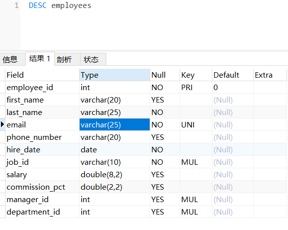
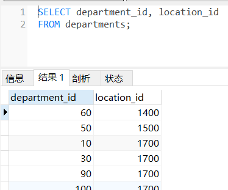
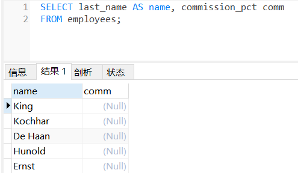
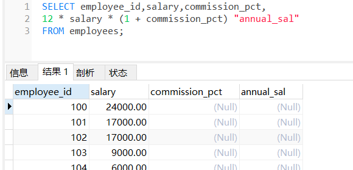
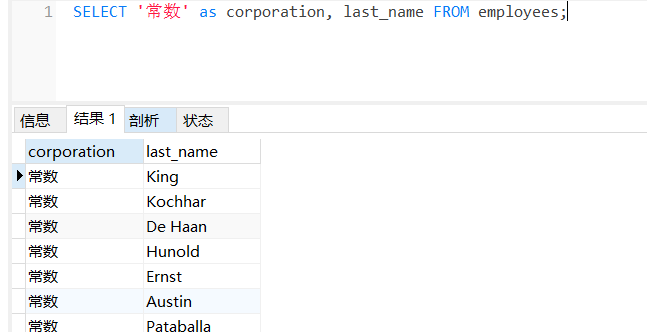
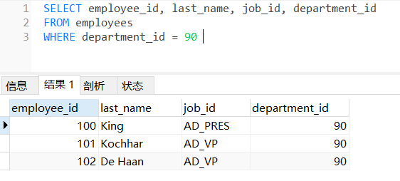

## 1. SQL分类
- DDL（Data Definition Languages、数据定义语言），这些语句定义了不同的数据库、表、视图、索 引等数据库对象，还可以用来创建、删除、修改数据库和数据表的结构。 主要的语句关键字包括 CREATE 、 DROP 、 ALTER 等。
	- 主要的语句关键字包括 CREATE 、 DROP 、 ALTER 等。
- DML（Data Manipulation Language、数据操作语言），用于添加、删除、更新和查询数据库记 录，并检查数据完整性。
	- 主要的语句关键字包括 INSERT 、 DELETE 、 UPDATE 、 SELECT 等。
	- SELECT是SQL语言的基础，最为重要。
- DCL（Data Control Language、数据控制语言），用于定义数据库、表、字段、用户的访问权限和 安全级别。
	- 主要的语句关键字包括 GRANT 、 REVOKE 、 COMMIT 、 ROLLBACK 、 SAVEPOINT 等。

> [!NOTE]
> 因为查询语句使用的非常的频繁，所以很多人把查询语句单拎出来一类：DQL（数据查询语言）。 还有单独将 COMMIT 、 ROLLBACK 取出来称为TCL （Transaction Control Language，事务控制语 言）。


## 2. SQL语言的规则与规范
### 2.1 基本规则
* SQL 可以写在一行或者多行。
* 为了提高可读性，各子句分行写，必要时使用缩进 
* 每条命令以 ; 或 \g 或 \G 结束 
* 关键字不能被缩写也不能分行 
* 关于标点符号:
	* 必须保证所有的()、单引号、双引号是成对结束的
	* 必须使用英文状态下的半角输入方式
	* 字符串型和日期时间类型的数据可以使用单引号（' '）表示
	* 列的别名，尽量使用双引号（" "），而且不建议省略as

### 2.2 SQL大小写规范
- MySQL 在 Windows 环境下是大小写不敏感的
- MySQL 在 Linux 环境下是大小写敏感的
	- 数据库名、表名、表的别名、变量名是严格区分大小写的
	- 关键字、函数名、列名(或字段名)、列的别名(字段的别名) 是忽略大小写的。

- 采用统一的书写规范：
	- 数据库名、表名、表别名、字段名、字段别名等都小写
	- SQL 关键字、函数名、绑定变量等都大写

### 2.3 注 释
> 单行注释：#注释文字(MySQL特有的方式) 
> 单行注释：-- 注释文字(--后面必须包含一个空格。) 
> 多行注释：/* 注释文字 */

### 2.4 命名规则
- 数据库、表名不得超过30个字符，变量名限制为29个
- 必须只能包含 A–Z, a–z, 0–9, _共63个字符
- 数据库名、表名、字段名等对象名中间不要包含空格
- 同一个MySQL软件中，数据库不能同名；同一个库中，表不能重名；同一个表中，字段不能重名
- 必须保证字段没有和保留字、数据库系统或常用方法冲突。如果坚持使用，请在SQL语句中使 用`（着重号）引起来
- 保持字段名和类型的一致性，在命名字段并为其指定数据类型的时候一定要保证一致性。假如数据 类型在一个表里是整数，那在另一个表里可就别变成字符型了
```sql
#以下两句是一样的，不区分大小写 
show databases; 
SHOW DATABASES; 
#创建表格 
create table student info(...); #表名错误，因为表名有空格 
create table student_info(...); #其中order使用``飘号，因为order和系统关键字或系统函数名等预定义标识符重名了 
CREATE TABLE `order`(
	id INT, 
	lname VARCHAR(20) 
	); 
select id as "编号", `name` as "姓名" from t_stu; #起别名时，as都可以省略 
select id as 编号, `name` as 姓名 from t_stu; #如果字段别名中没有空格，那么可以省略"" 
select id as 编 号, `name` as 姓 名 from t_stu; #错误，如果字段别名中有空格，那么不能省略""
```

### 2.5 数据导入指令
在命令行客户端登录mysql，使用source指令导入
```mysql
mysql> source d:\mysqldb.sql
```

```sql
mysql> desc employees; 
```


## 3. 基本的SELECT语句

### 3.1 SELECT ... FROM

选择全部列：
```sql
SELECT * FROM departments;
```

选择特定的列：
```sql
SELECT department_id, location_id FROM departments;
```


### 3.2 列的别名
- 重命名一个列 
- 便于计算 
- 紧跟列名，也可以在列名和别名之间加入关键字AS，别名使用双- - 引号，以便在别名中包含空格或特殊的字符并区分大小写。 
- AS 可以省略 
- 别名简短，见名知意
```sql
SELECT last_name AS name, commission_pct comm
FROM employees;
```


### 3.3 去除重复行
```sql
SELECT DISTINCT department_id FROM employees;
```


> [!Warnning]
> 1. DISTINCT 需要放到所有列名的前面，如果写成 SELECT salary, DISTINCT department_id FROM employees 会报错。
> 2. DISTINCT 其实是对后面所有列名的组合进行去重。

### 3.4 空值参与运算

> [!Warnning]
> 所有运算符或列值遇到null值，运算的结果都为null

```sql
SELECT employee_id,salary,commission_pct,
12 * salary * (1 + commission_pct) "annual_sal"
FROM employees;
```



> [!Warnning]
> 空值不等于空字符串。一个空字符串的长度是 0，而一个空值的长 度是空。而且，在 MySQL 里面，空值是占用空间的。

### 3.5 着重号
```sql
SELECT * FROM ORDER;
SELECT * FROM `ORDER`;
```

### 3.6 查询常数
SQL 中的 SELECT 语法的确提供了这个功能，一般只从一个表中查询数据，通常不需要增加一个固定的常数列.
但如果想整合不同的数据源，用常数列作为这个表的标记，就需要查询常数。 
比如说，想对 employees 数据表中的员工姓名进行查询，同时增加一列字段 corporation ，这个 字段固定值为“常数”
```sql
SELECT '常数' as corporation, last_name FROM employees;
```


## 4. 显示表结构
使用DESCRIBE 或 DESC 命令，表示表结构。
```sql
DESCRIBE employees; 
DESC employees;
```

## 5. 过滤数据
```sql
SELECT 字段1,字段2 FROM 表名 WHERE 过滤条件
```
* 使用WHERE 子句，将不满足条件的行过滤掉 
* WHERE子句紧随 FROM子句


## 6. 联系
```sql
# 1.查询员工12个月的工资总和，并起别名为ANNUAL SALARY
SELECT employee_id, last_name, salary * 12 * (1 + IFNULL(commission_pct, 0)) AS "ANNUAL SALARY" FROM employees;

# 2.查询employees表中去除重复的job_id以后的数据
SELECT DISTINCT job_id from employees;

# 3.查询工资大于12000的员工姓名和工资
SELECT last_name, salary FROM employees WHERE salary>12000;

# 4.查询员工号为176的员工的姓名和部门号
SELECT last_name, department_id
FROM employees
WHERE employee_id = 176;

# 5.显示表 departments 的结构，并查询其中的全部数据
DESC departments;
SELECT * FROM departments;
```