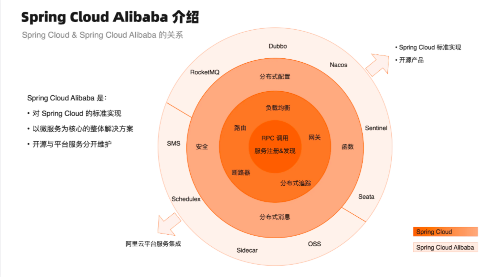
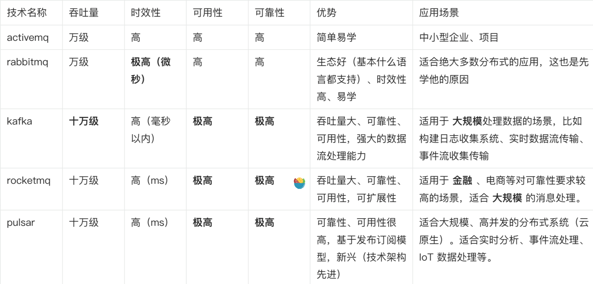
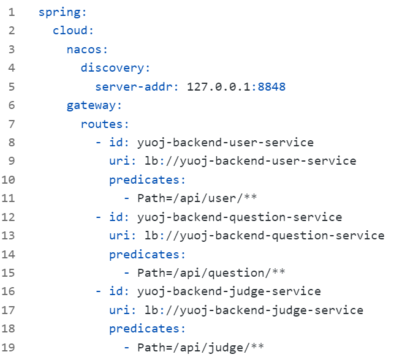
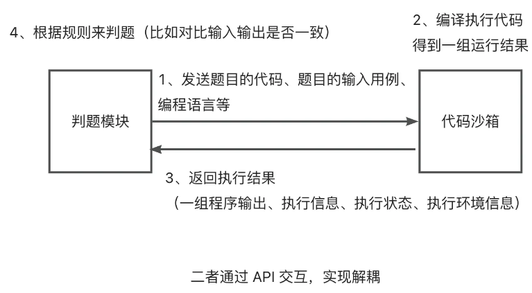

后端  

请介绍整个系统后端的架构设计，有哪些模块以及各模块之间的关系？  
主观回答  
  
整个系统的后端分为：  
●用户服务：提供用户登录、用户的增删改查等管理功能  
●题目服务：提供题目的增删改查管理、题目提交功能  
●判题服务：提供判题功能，调用代码沙箱并比对判题结果  
●代码沙箱：提供编译执行代码、返回结果的功能  
●公共模块：提供公共代码，比如数据模型、全局请求响应封装、全局异常处理、工具类等  
●网关服务：提供统一的 API 转发、聚合文档、全局跨域解决等功能  
  
各模块之间的关系，3 个核心：  
1由网关服务集中接受前端的请求，并转发到对应的业务服务。  
2判题服务需要调用题目服务获取题目信息和测试用例、调用代码沙箱完成代码的编译和执行并比对结果，服务间通过 Open Feign 相互调用。  
3所有服务都需要引入公共模块。

什么是微服务架构？它有什么优点？为什么在项目中选择使用微服务架构？  
前半句背诵类题目，后半句主观回答  
  
微服务架构是一种软件架构风格，把大而全的单体应用程序拆分为多个职责单一的服务单元，每个服务单元都能独立部署、运行和维护。服务单元之间通过网络通信进行交互，从而实现完整的系统功能。  
用一家公司来类比，如果公司内的每个员工身兼数职、个个都是扛把子，如果一个员工请假了，那么可能会影响整个公司业务的推进。而如果把公司员工按照职责划分部门，每个部门的员工只负责做好该部门的工作，那么一个部门有事情，其他部门仍可继续工作。  
由此可见，使用微服务架构可以提高系统的灵活性、可维护性、可扩展性、容错性。  
在本项目中，使用微服务架构的主要原因是将较重的服务（判题服务）和核心业务（用户和题目服务）进行分离解耦。即使判题服务因为代码沙箱的压力过大而阻塞，也不会影响核心业务的运行，比如用户依然可以查看题目。  
而且使用微服务架构重构单体系统后，判题服务可以独立于主业务进行部署和扩展，更加灵活。

什么是 Spring Cloud Alibaba？它和 Spring Cloud 有什么区别？由哪些核心技术组成？  
背诵类题目  
  
Spring Cloud Alibaba 是基于 Spring Cloud 构建的一套微服务开发一站式解决方案，能够提高开发者构建分布式应用的效率。  
它在 Spring Cloud 的基础上额外增加了一些特定于阿里云的解决方案和工具，以满足在云原生应用开发中的一些需求。  
比如：  
1Nacos：服务注册和配置中心  
2Sentinel：熔断限流  
3Seata：分布式事务  
4RocketMQ：消息队列，削峰填谷  
5Sidecar：异构服务接入  
6SMS：阿里云短信服务  
7OSS：阿里云存储服务

你在项目中是如何设计库表的？可以从字段、索引、关联等方面回答。  
主观回答  
  
本项目主要包含 3 个核心表：用户表、题目表、题目提交表  
其中几个关键设计：  
1在题目表中，通过 json 对象字符串存储判题配置信息（timeLimit 和 memoryLimit 等），而不是把每种具体的配置单独作为一列存储，便于该字段的读写和扩展。  
2题目表和题目提交表中，给 userId、questionId 增加索引，提高查询性能  
3题目提交表包含了 status 判题状态字段，采用 int 类型进行存储，节约存储空间，并且在业务代码中针对每个 int 值定义一个枚举。

介绍一下判题机模块的架构？尤其是代码沙箱的抽象调用接口和实现类。  
主观回答  
  
判题机模块的作用是：查询题目提交和题目信息，调用代码沙箱，把代码和输入用例交给代码沙箱去执行，收集输出结果并执行判题逻辑。  
为了设计灵活、可扩展的判题机模块，我用了多种设计模式和方法：  
1）为了提高系统的灵活性，对于代码沙箱的调用，我没有选择硬编码的方式指定单一的代码沙箱，而是定义了一个通用的代码沙箱调用接口，并且提供了多种代码沙箱调用的实现类，比如：  
●示例代码沙箱：仅为了跑通业务流程  
●远程代码沙箱：调用自己开发的沙箱接口  
●第三方代码沙箱：调用网上现成的代码沙箱服务  
2）为了简化代码沙箱调用实例的获取，我使用工厂模式，根据代码沙箱的类型字符串来生成对应的代码沙箱调用实现类。  
3）为了解决代码沙箱硬编码的问题，我将代码沙箱的类型字符串配置化，可以通过更改 application.yml 中的配置动态切换调用的代码沙箱。  
4）为了在调用代码沙箱前后进行统一的日志操作，我使用代理模式对代码沙箱进行封装，能够在不改变代码沙箱调用实现类的前提下，集中地增强代码沙箱的能力。

为什么使用策略模式来封装不同语言的判题算法，它有哪些好处？具体如何实现？  
主观回答  
  
由于不同的编程语言可能会有不同的判题逻辑，比如 Java 语言的内存和时间限制需要适当增加，把这些判题逻辑如果都写在 service 中通过 if ... else ... 来区分，整个代码文件的圈复杂度就会很高，不利于阅读和维护。  
所以我使用策略模式，具体实现方式和好处如下：  
1定义判题策略接口 JudgeStrategy，提供 doJudge 判题方法，让代码更加 通用化 。  
2将不同语言的判题算法分别封装成不同的策略类，实现上述接口，比如 JavaLanguageJudgeStrategy。这样一来，需要修改某个策略时只需要修改对应的类即可，便于维护和扩展 。  
3定义了 JudgeContext 上下文类，用于存储判题策略需要用到的信息，传递给策略类。  
4定义了 JudgeManager 类，在这个类中根据具体的编程语言来执行对应的策略，从而 简化了 service 的调用 。

你在项目中使用了 2 种方式来实现代码沙箱，请介绍一下这两种方式的实现原理和区别？  
主观回答  
  
Java 原生代码沙箱和 Docker 代码沙箱这两种实现方式的核心业务流程是相同的，都需要经历以下几个步骤：  
1把用户的代码保存为文件  
2编译代码，得到 class 文件  
3执行 Java 代码  
4收集整理输出结果  
5文件清理，释放空间  
6错误处理，提升程序健壮性  
  
区别在于：Java 原生代码沙箱是通过 Runtime.exec 执行命令行操作来执行代码，并通过 Process 对象的流来获取输出结果，不够安全；Docker 代码沙箱是通过创建隔离的 Java 容器并且通过 exec 命令在容器内执行 Java 代码和获取输出，更加安全。

什么是 Java 安全管理器？你在项目中是如何使用它来实现权限控制的？  
前半句背诵类题目，后半句主观回答  
  
Java 安全管理器（Security Manager）是 Java 提供的安全性工具，用于控制 Java 应用程序对系统资源的访问和执行权限。它通过定义安全策略文件来管理和限制 Java 程序的操作，以确保程序不会越权访问系统资源或执行危险操作。  
本项目中，我通过继承 SecurityManager 类自定义了一个安全管理器，通过覆写 checkWrite 和 checkExec 的方式限制了禁止用户写文件和执行文件。  
然后修改代码沙箱执行 Java 代码的命令，绑定定义好的安全管理器（-Djava.security.manager=MySecurityManager），从而限制了用户代码中的部分危险操作。

你了解哪些 JVM 参数，请分别介绍它们的作用？  
背诵类题目，也可以加主观回答  
  
JVM 参数是用于配置 Java 虚拟机运行时行为的一种方式。  
以下是一些常见的 JVM 参数以及它们的作用（前 2 个一定要记住）：  
1-Xmx: 用于设置JVM的最大堆内存大小。例如，"-Xmx512m"表示将最大堆内存设置为512MB。  
2-Xms: 用于设置JVM的初始堆内存大小。例如，"-Xms256m"表示初始堆内存为256MB。  
3-Xss: 用于设置每个线程的堆栈大小。例如，"-Xss1m"表示将堆栈大小设置为1MB。  
4-Xmn: 用于设置年轻代的堆内存大小。例如，"-Xmn256m"表示将年轻代的堆内存设置为256MB。  
5-XX:PermSize: 用于设置永久代的初始大小。在Java 8及之后的版本中，永久代已被元空间（Metaspace）取代。  
6-XX:MaxPermSize: 用于设置永久代的最大大小。在Java 8及之后的版本中，永久代已被元空间（Metaspace）取代。  
7-XX:MaxMetaspaceSize: 用于设置元空间的最大大小。在Java 8及之后的版本中，用于控制元空间大小。  
8-XX:NewRatio: 用于设置年轻代与老年代的内存比例。例如，"-XX:NewRatio=2"表示年轻代占整个堆内存的1/3，老年代占2/3。  
9-XX:MaxTenuringThreshold: 用于设置对象在年轻代中经历多少次垃圾回收后晋升到老年代。默认值通常为15。  
10-XX:SurvivorRatio: 用于设置Eden区和Survivor区的内存比例。例如，"-XX:SurvivorRatio=8"表示Eden区占整个年轻代的8/10，每个Survivor区占1/10。  
11-XX:+UseConcMarkSweepGC: 启用CMS（Concurrent Mark-Sweep）垃圾回收器。  
12-XX:+UseG1GC: 启用G1（Garbage-First）垃圾回收器。  
13-XX:MaxGCPauseMillis: 用于设置垃圾回收的最大暂停时间目标。  
14-XX:ParallelGCThreads: 用于设置并行垃圾回收线程的数量。  
15-XX:+PrintGCDetails: 打印垃圾回收详细信息。  
  
在本项目中，我在用代码沙箱执行 Java 程序时，指定了 -Xmx 参数限制了程序执行占用的最大堆内存，一定程度上保护了系统。

什么是 Docker？为什么要在项目中用到 Docker？以及你在项目中是如何使用 Docker 的？  
前半句背诵类题目，后半句主观回答  
  
Docker是一种容器化技术，它允许开发者将应用程序及其所有依赖项打包到一个独立的容器中，包括操作系统、库、运行时环境等。这个容器可以在任何支持 Docker 的平台上运行，确保应用程序在不同环境中具有一致的行为。  
在本项目中使用 Docker 主要是为了保证代码沙箱服务执行用户代码的安全性，防止影响宿主机。  
我首先在 Linux 虚拟机内安装了 Docker，然后用 Docker 命令行跑通了一次从拉取镜像、执行容器再到删除容器的完整流程。在代码沙箱项目中，使用 Docker Java 库来操作 Docker，包括 Docker 容器的创建、连接 Docker 容器执行命令、获取 Docker 容器的日志和输出、获取 Docker 容器的内存占用等。

你是怎么保证 Docker 代码沙箱执行程序时的安全性的？  
主观回答  
  
虽然 Docker 本身提供了一个隔离的代码执行环境，但仍无法做到绝对的安全，所以我通过以下几种方法，进一步提高 Docker 代码沙箱的安全性。  
1超时控制：在向容器发送执行命令时，指定超时参数，超时自动中断  
2资源限制：创建容器实例时，通过 HostConfig 指定分配的最大内存和 CPU 占用  
3网络限制：创建容器实例时，通过 withNetworkDisabled 方法禁用网络  
4权限管理：通过 seccomp 或者 Java 安全管理器，限制用户代码允许的操作和调用

为什么在项目中使用模板方法模式来定义代码沙箱执行流程？它有什么优势？  
主观回答  
  
由于 Java 原生代码沙箱和 Docker 代码沙箱这两种实现方式的核心业务流程是相同的，且一些过程是完全可以复用的，所以使用模板方法模式。  
实现步骤如下：  
1先定义了一个抽象的代码沙箱模板类，用一个方法定义了核心流程（保存文件、编译代码、执行代码、收集结果、文件清理、错误处理）  
2在模板类中，把每个环节单独定义为一个方法，可供子类覆写。  
3每种代码沙箱的实现类继承模板类，可以复用模板类的默认环节实现（比如保存文件），也可以重写某一个环节（比如 Docker 代码沙箱重写执行逻辑）。  
使用模板方法模式后，大幅减少了重复代码，并且让整个系统的流程更加清晰，提升了项目的可扩展性。

为什么在项目中使用 RabbitMQ 消息队列来处理判题操作？它有什么优势？  
主观回答  
  
由于判题操作是一个比较重的服务（需要调用代码沙箱），使用 RabbitMQ 消息队列对判题操作进行异步化解耦。  
改造后的业务流程：用户提交题目时，由题目服务发送一条消息到队列，然后判题服务监听到该队列的消息并进行判题处理，并且异步更改题目的判题状态。  
这样做的好处：  
●对用户来说：不需要在前端同步等待，优化了体验  
●对系统来说：解耦了题目服务和判题服务，两者不需要相互调用，即使判题服务繁忙或宕机，题目服务依然可以发送判题任务到队列，等判题服务恢复后继续处理。  
  
在选用 RabbitMQ 消息队列前，我做过充分的技术选型和调研。发现 RabbitMQ 不仅简单易用（通过阅读官方文档就能上手开发），而且其时效性极低（延迟最低，微秒级）。此外，RabbitMQ 支持消息确认机制、延迟队列、死信队列等特性，能够满足业务对于消息可靠性的需求，这是我选择它的原因。  
具体的优点和缺点请见消息队列技术对比表格：

你如何保证代码沙箱服务接口的安全性？  
主观回答  
  
由于代码沙箱服务提供了暴露在外的接口，所以必须通过某种权限校验机制保证安全。  
有 2 种方式：  
1调用方与服务提供方之间约定一个加密字符串，调用方发送请求时必须在请求头中携带该字符串，服务提供方会从请求头中取出该字符串并进行比对。  
2使用 API 签名认证机制，给可信的调用方分配 accessKey、secretKey。在调用方发送请求时，会使用 secretKey 对请求参数等内容进行签名，并设置在请求头中；服务提供方会用同样的 secretKey 对请求参数等内容进行签名，然后校验签名是否一致。  
  
第 1 种方式的优点是简单易实现，但是不够安全，比较适合相对可信的内网环境调用；如果需要将服务暴露在公网，那么推荐第 2 种方式。

请介绍一下使用 Redis 分布式 Session 实现用户登录的原理？  
背诵类题目  
  
实现步骤如下：  
1用户登录过程：用户登录成功后，在后端生成一个唯一的 Session 标识（通常是一个SessionID），用于标识该用户的登录状态。  
2用户信息存储：用户信息包括用户 id、昵称、角色等，封装到一个 Java 对象中，然后将其存储到 Redis。  
3生成 SessionID：生成一个唯一的 SessionID，通常是一个随机字符串，用于关联用户和 Session信息。  
4Session 信息存储到 Redis：存储时使用 SessionID 作为键，将用户信息序列化为字符串或其他适当的格式作为值，存储的时效性通常由 Session 的过期时间决定。  
5SessionID 返回给前端：将生成的 SessionID 返回给前端，通常通过 HTTP 的 Cookie 或其他方式返回（这一步由框架帮你做了）  
6后续请求：用户的后续请求会携带 SessionID，后端通过 SessionID 从 Redis 中获取用户信息，以便进行用户身份验证。  
7Session 过期管理：一定要设置 Session 的过期时间，确保 Session 在用户不活动的一段时间后自动失效，以释放资源并提高安全性。

什么是 Nacos？你的微服务项目中，哪些服务要和 Nacos 交互？  
主观回答  
  
官方的定义是：一个更易于构建云原生应用的动态服务发现、配置管理和服务管理平台。  
更简单直接的定义：服务注册中心、配置中心。  
本项目中，几乎所有的微服务模块都要和 Nacos 交互，比如：  
●用户服务、判题服务、题目服务：在 Nacos 上注册，以实现各服务的相互调用  
●微服务网关：在 Nacos 上注册，并通过 Nacos 发现下游服务地址，实现请求转发

什么是 OpenFeign？你的微服务项目中，有哪些接口需要使用 OpenFeign 调用？  
主观回答  
  
Open Feign 是一个声明式 Web 客户端调用库，它简化了创建 HTTP 请求的过程，并允许你将 HTTP 请求映射到 Java 接口的方法上。  
使用它后，可以更方便地调用远程的 API 服务，无需自己手动编写 HTTP 请求，提高开发效率。  
本项目中，我通过 IDEA 开发工具的 Find Usages 功能快速定位了服务的调用关系，并且梳理了服务调用依赖表，总共有以下接口需要 OpenFeign 调用：  
用户服务：  
●userService.getById(userId)  
●userService.listByIds(userIdSet)  
题目服务：  
●questionService.getById(questionId)  
●questionSubmitService.getById(questionSubmitId)  
●questionSubmitService.updateById(questionSubmitUpdate)  
判题服务：  
●judgeService.doJudge(questionSubmitId)

项目中使用了 Gateway 网关，请介绍它的作用，以及如何实现了服务的路由？  
主观回答  
  
Gateway 作为 API 网关，可以集中接受客户端的请求，并执行统一的安全认证、请求转发、流量控制、请求日志、公共业务等操作。  
在本项目中，我使用 Gateway 实现了全局请求转发、全局跨域问题的解决、全局内部服务的保护。  
服务的路由是通过 Nacos 服务注册发现 + 配置的方式实现的，通过 gateway.routes 针对每个服务配置了路由的负载均衡地址、路由前缀匹配规则等

当网关接收到请求时，会根据 predicates 的 Path 来匹配请求到对应的路由，然后通过 lb 负载均衡地址到 Nacos 上找到对应的服务实例地址，并最终发起调用。

你是如何通过自定义 Gateway 的 GlobalFilter 来保护接口的，请介绍具体实现过程？  
主观回答  
  
背景：为防止服务内部相互调用的接口被外部系统访问，需要在网关集中定义接口保护逻辑。  
具体实现：GlobalFilter 是 Spring Cloud Gateway 提供的全局请求拦截接口，我编写了一个类实现了该接口，重写了其 filter 方法，并在该方法中编写了接口保护逻辑。  
接口保护逻辑：获取到当前请求的目标路径，使用 AntPathMatcher 判断该路径是否包含 inner，如果包含的话，设置响应码为 403 FORBIDDEN 并返回；不包含的话，放行请求继续执行。  
值得一提的是，为了让上述逻辑优先生效，我让这个类实现了 Ordered 接口并且将 getOrder 方法的返回值设置为 0（最高优先级），能够做到尽早拦截违规请求，避免不必要的开销。

你的项目中实现了接口文档的统一聚合，请介绍具体的实现过程？  
主观回答  
  
使用 Knife4j 接口文档生成器，参考官方文档完成了聚合：[https://doc.xiaominfo.com/docs/middleware-sources/spring-cloud-gateway/spring-gateway-introduction](https://doc.xiaominfo.com/docs/middleware-sources/spring-cloud-gateway/spring-gateway-introduction)  
具体步骤如下：  
1先给所有业务服务引入 Knife4j 依赖，同时在配置文件中开启接口文档  
2给网关服务引入 Knife4j Gateway 依赖，并且通过在配置文件中指定 discover 模式，让系统自动查找业务服务的文档、自动完成聚合  
3访问网关的 doc.html 地址，即可查看聚合接口文档

请介绍一下本项目的完整业务流程？  
管理员创建题目、添加题目的测试用例 => 用户自由搜索题目 => 用户阅读题目、编写并提交代码 => 系统后端调用 代码沙箱，对代码进行编译、运行 => 判题服务根据管理员设定的题目测试用例判断用户提交是否正确 => 用户可以查看提交记录和判题结果。  
其中，代码沙箱可以作为独立服务，提供给其他开发者使用。

有调研过 OJ 系统的实现方案么？  
有的，我在开发 OJ 系统前，调研了非常多的开源项目，比如 HOJ、hustoj 等，总结了 5 种常见的实现方案。  
1自部署现成的开源 OJ 系统  
2使用现成的执行代码接口  
3自主开发 OJ 系统和代码沙箱  
4利用 AI 实现判题  
5通过类似爬虫的方式调用其他网站的判题接口

请介绍一下判题的具体流程和方法？  
判题步骤如下：  
1首先根据用户的提交 id 获取到用户的代码、选择的编程语言、题目测试用例、题目执行限制等信息。  
2判题服务调用代码沙箱服务执行用户代码，获取到每组测试用例对应的输出结果、代码执行信息（比如内存、时间占用等）。  
3对比用户的输出结果和正确的输出结果，并判断代码的执行信息是否符合题目执行限制，得出判题结果，并修改数据库内对应的提交信息。

请介绍一下代码沙箱的作用？代码沙箱和判题服务有什么关系？  
代码沙箱的作用：在隔离的环境中编译并执行代码，得到运行结果。可以作为独立的项目或服务，提供给其他的需要执行代码的项目去使用。  
  
代码沙箱和判题服务的关系：  
●代码沙箱：只负责接受代码和输入，返回编译运行的结果，不负责判题  
●判题模块：调用代码沙箱，把代码和输入用例交给代码沙箱去执行  
具体交互过程如下图：

问题：如何避免创建过多Docker沙箱导致被OOM Killer策略清理?  
答题思路：反压Linux的性能监控信息给沙箱调度服务，让沙箱调度服务动态切换服务器资源。  
可扩展点：  
●调整Linux系统的内核参数，以优化内存管理和性能。  
●配置OOM Killer的行为，以减少不必要的进程杀戮。  
●提取服务器性能特征，通过长短期记忆网络（LSTM）预测服务器压力从而判断发生OOM killer的时机

问题：如何保证代码提交的安全性？（如何检测代码中的恶意代码）  
答题思路：使用OWASP Find Security Bugs配合OWASP安全库做静态代码安全检测，然后使用docker作环境隔离。  
可扩展点：  
●代码特征工程，加入向量数据库（miluvs），加快判断速度以及提升并发性  
●加入用户黑名单机制，多次触发检测阈值，直接拉黑用户

