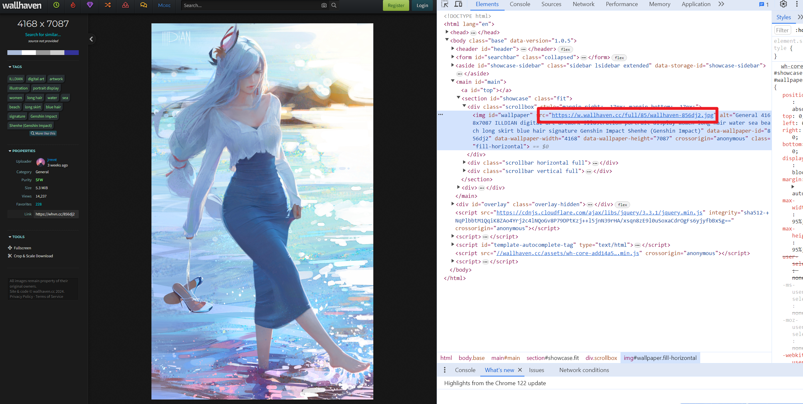
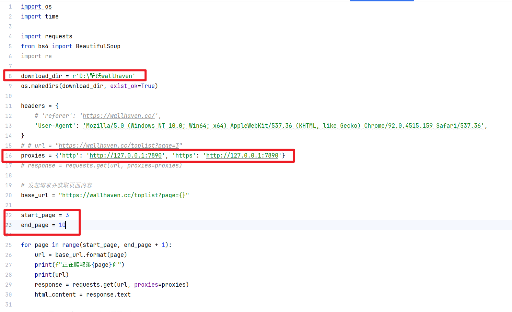
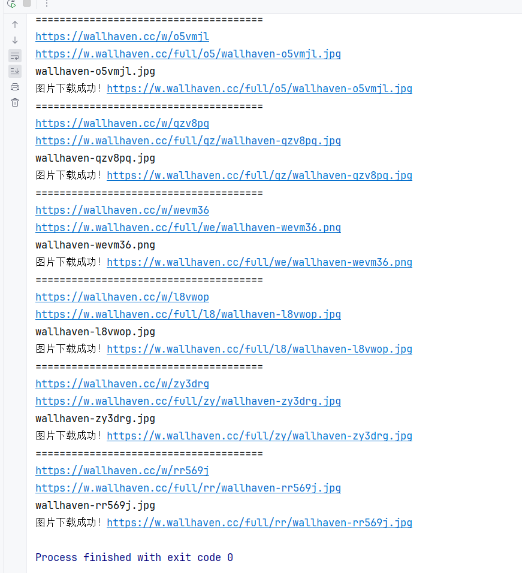

# wallhaven壁纸网站爬虫

## 基础库
```python
import os  
import time  
  
import requests  
from bs4 import BeautifulSoup  
import re

# 使用pip install re安装
```

##  思路分析


- 分析上面的几个url，发现toplist与hot只是单词不同，page代表第几页，一页24副图片。
- 查看网页源码，分析缩略图的链接。
- 根据缩略的url与原图的url对比，发现仅需替换单词而已。
- 例如缩略图的链接https://th.wallhaven.cc/small/85/856dj2.jpg
- 原图链接https://w.wallhaven.cc/full/85/wallhaven-856dj2.jpg
- 因此仅需使用正则进行替换即可。
- 但是在爬取过程中发现有的图片无法下载，分析原因：
	- 缩略图全是jpg格式，而原图不一定是jpg格式，可能是png等等
	- 如何解决呢？总不能把全部格式全下载一遍吧。
	- 采取二级爬虫。

## 二级爬虫

```python
import os  
import time  
  
import requests  
from bs4 import BeautifulSoup  
import re  
  
download_dir = r'D:\壁纸wallhaven'  
os.makedirs(download_dir, exist_ok=True)  
  
headers = {  
    # 'referer': 'https://wallhaven.cc/',  
    'User-Agent': 'Mozilla/5.0 (Windows NT 10.0; Win64; x64) AppleWebKit/537.36 (KHTML, like Gecko) Chrome/92.0.4515.159 Safari/537.36',  
}  
# # url = "https://wallhaven.cc/toplist?page=3"  
proxies = {'http': 'http://127.0.0.1:7890', 'https': 'http://127.0.0.1:7890'}  
# response = requests.get(url, proxies=proxies)  
  
# 发起请求并获取页面内容  
base_url = "https://wallhaven.cc/toplist?page={}"  
  
start_page = 3  
end_page = 10  
  
for page in range(start_page, end_page + 1):  
    url = base_url.format(page)  
    print(f"正在爬取第{page}页")  
    print(url)  
    response = requests.get(url, proxies=proxies)  
    html_content = response.text  
  
    # 使用BeautifulSoup解析页面内容  
    soup = BeautifulSoup(html_content, "html.parser")  
    # 找到所有class为"preview"的链接  
    preview_links = soup.find_all("a", class_="preview")
```

- 上述代码获取到预览的链接
- 使用BeautifulSoup进行解析预览的链接
- 再次进行爬取，爬取预览链接里面的内容
- 
- 可见，针对爬取到的内容进行清洗页面，获取原图链接

## 获取原图链接
```python
for page in range(start_page, end_page + 1):  
    url = base_url.format(page)  
    print(f"正在爬取第{page}页")  
    print(url)  
    response = requests.get(url, proxies=proxies)  
    html_content = response.text  
  
    # 使用BeautifulSoup解析页面内容  
    soup = BeautifulSoup(html_content, "html.parser")  
    # 找到所有class为"preview"的链接  
    preview_links = soup.find_all("a", class_="preview")  
  
    # 提取链接并打印  
    for link in preview_links:  
        href = link.get("href")  
        print("======================================")  
        print(href)  
        time.sleep(1)  
        # 发起GET请求并下载图片  
        try:  
  
            response_2 = requests.get(href, proxies=proxies)  
  
            # 使用BeautifulSoup解析HTML内容  
            soup = BeautifulSoup(response_2.text, "html.parser")  
  
            # 找到id为"wallpaper"的img标签  
            wallpaper_img = soup.find("img", id="wallpaper")
```

- 再次使用soup清洗页面，获取链接，到此即可拿到原图链接
- 再进行下载，写入文件即可

## 完整源码

```python
import os  
import time  
  
import requests  
from bs4 import BeautifulSoup  
import re  
  
download_dir = r'D:\壁纸wallhaven'  
os.makedirs(download_dir, exist_ok=True)  
  
headers = {  
    # 'referer': 'https://wallhaven.cc/',  
    'User-Agent': 'Mozilla/5.0 (Windows NT 10.0; Win64; x64) AppleWebKit/537.36 (KHTML, like Gecko) Chrome/92.0.4515.159 Safari/537.36',  
}  
# # url = "https://wallhaven.cc/toplist?page=3"  
proxies = {'http': 'http://127.0.0.1:7890', 'https': 'http://127.0.0.1:7890'}  
# response = requests.get(url, proxies=proxies)  
  
# 发起请求并获取页面内容  
base_url = "https://wallhaven.cc/toplist?page={}"  
  
start_page = 3  
end_page = 10  
  
for page in range(start_page, end_page + 1):  
    url = base_url.format(page)  
    print(f"正在爬取第{page}页")  
    print(url)  
    response = requests.get(url, proxies=proxies)  
    html_content = response.text  
  
    # 使用BeautifulSoup解析页面内容  
    soup = BeautifulSoup(html_content, "html.parser")  
    # 找到所有class为"preview"的链接  
    preview_links = soup.find_all("a", class_="preview")  
  
    # 提取链接并打印  
    for link in preview_links:  
        href = link.get("href")  
        print("======================================")  
        print(href)  
        time.sleep(1)  
        # 发起GET请求并下载图片  
        try:  
  
            response_2 = requests.get(href, proxies=proxies)  
  
            # 使用BeautifulSoup解析HTML内容  
            soup = BeautifulSoup(response_2.text, "html.parser")  
  
            # 找到id为"wallpaper"的img标签  
            wallpaper_img = soup.find("img", id="wallpaper")  
  
            # 提取链接并打印  
            src_link = wallpaper_img.get("src")  
            print(src_link)  
  
            file_name = src_link.split("/")[-1]  
            print(file_name)  
  
            # 发起GET请求并下载图片  
            response = requests.get(src_link, proxies=proxies)  
  
            # 检查请求是否成功  
            if response.status_code == 200:  
                # 保存图片到本地  
                with open(os.path.join(download_dir, f"{file_name}"), "wb") as f:  
                    f.write(response.content)  
                print("图片下载成功！" + src_link)  
            else:  
                print("下载失败，状态码：", response.status_code, '"', src_link, '"')  
        except Exception as e:  
            print("爬取失败:", e)  
            continue  # 跳过当前链接，继续处理下一个链接
```

## 注意
- 需要使用代理
- 使用clash默认端口号为7890
- 其他代理更改为对应的代理即可
- 壁纸保存的位置
- 代理
- 开始与结束的页码，一页24张
- 

