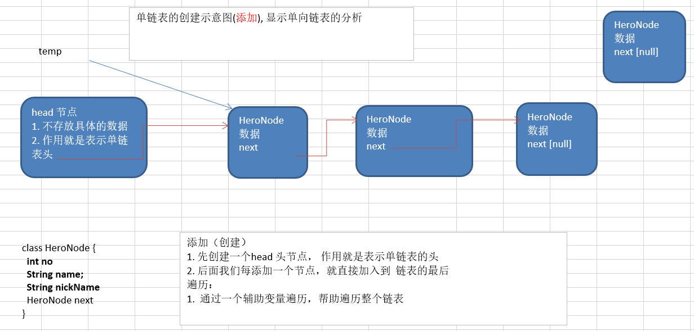

# 单链表：连接数据的链条

单链表是一种基本的数据结构，通过节点之间的引用关系，将数据连接成链条。

## 1. 单链表的基本概念

单链表由节点组成，每个节点包含两部分：数据和指向下一个节点的引用。节点之间的链接形成了一个链表，最后一个节点的引用为空，表示链表的结束。



## 2. 单链表的实现

### 2.1 Java实现单链表的基本操作

```java
package org.example;  
  
public class SingleLinkedListDemo {  
    public static void main(String[] args) {  
        HeroNode heroNode1 = new HeroNode(1, "一号", "1号");  
  
        HeroNode heroNode2 = new HeroNode(2, "二号", "2号");  
  
        HeroNode heroNode3 = new HeroNode(3, "三号", "3号");  
  
        HeroNode heroNode4 = new HeroNode(4, "四号", "4号");  
  
        HeroNode heroNode5 = new HeroNode(4, "四号", "4号");  
  
        HeroNode heroNode6 = new HeroNode(6, "六号", "6号");  
  
//        创建链表  
        SinglelinkedList singlelinkedList = new SinglelinkedList();  
//        加入  
        singlelinkedList.add(heroNode1);  
        singlelinkedList.add(heroNode2);  
        singlelinkedList.add(heroNode3);  
        singlelinkedList.add(heroNode4);  
  
        singlelinkedList.list();  
        singlelinkedList.del(heroNode3);  
        singlelinkedList.list();  
  
//        singlelinkedList.addByOrder(heroNode5);  
//        singlelinkedList.addByOrder(heroNode6);  
//        singlelinkedList.addByOrder(heroNode3);  
//        singlelinkedList.list();  
    }  
}  
  
//定义SingleLinkedList来管理角色  
class SinglelinkedList {  
    //    初始化头节点，不动头节点  
    private HeroNode head = new HeroNode(0, "", "");  
  
  
    public void add(HeroNode heroNode) {  
        //    添加节点搭配单向链表  
        //    思路：不考虑编号顺序时，  
        //    找到当前链表的最后节点，并将其next指向新的节点  
        HeroNode temp = head;  
//        遍历链表，找到最后一个  
        while (true) {//退出循环时，temp指向最后  
            if (temp.next == null) {  
                break;  
            }  
            temp = temp.next;  
        }  
        temp.next = heroNode;  
    }  
  
    public void addByOrder(HeroNode heroNode) {  
        HeroNode temp = head;  
//        temp位于添加的前一个节点  
        boolean flag = false;//添加的编号是否存在  
        while (true) {  
            if (temp.next == null) {//处在链表最后  
                break;  
            }  
            if (temp.next.no > heroNode.no) {//位置找到了  
                break;  
            } else if (temp.next.no == heroNode.no) {  
                flag = true;//说明编号存在  
                break;  
            }  
            temp = temp.next;  
        }  
//        判断flag  
        if (flag) {  
            System.out.println("准备插入的编号已经存在,不能加入");  
        } else {  
            //添加到链表中  
            heroNode.next = temp.next;  
            temp.next = heroNode;  
        }  
    }  
  
    //    根据no修改节点的信息  
    public void update(HeroNode heroNode) {  
//        判断是否为空  
        if (heroNode.next == null) {  
            System.out.println("链表为空");  
            return;  
        }  
        //找到需要修改的节点,根据no修改.遍历  
        HeroNode temp = head.next;  
        boolean flag = false;  
        while (true) {  
            if (temp.next == null) {  
                break;  
            }  
            if (temp.no == heroNode.no) {  
                flag = true;  
                break;  
            }  
            temp = temp.next;  
        }  
        if (flag) {  
            temp.nickname = heroNode.nickname;  
            temp.name = heroNode.name;  
        } else {  
            System.out.println("未找到编号");  
        }  
    }  
  
    public void del(HeroNode heroNode) {  
        //        判断是否为空  
        if (heroNode.next == null) {  
            System.out.println("链表为空");  
            return;  
        }  
        HeroNode temp = head.next;  
        boolean flag = false;  
        while (true) {  
            if (temp.next == null) {  
                break;  
            }  
            if (temp.next.no == heroNode.no) {  
                flag = true;  
                break;  
            }  
            temp = temp.next;  
        }  
        if (flag){  
            temp.next = temp.next.next;  
        }else {  
            System.out.println("要删除的不存在");  
        }  
    }  
  
    //    显示链表  
    public void list() {  
//        先判断链表是否为空  
        if (head.next == null) {  
            System.out.println("链表为空");  
            return;  
        }  
//        因为头节点不能动，因此需要辅助变量进行遍历  
        HeroNode temp = head.next;  
        while (true) {  
            if (temp == null) {  
                return;  
            }  
//            输出节点信息|  
            System.out.println(temp);  
//            temp后移  
            temp = temp.next;  
        }  
    }  
}  
  
  
//定义HeroNode,每个HeroNode对象就是一个节点  
class HeroNode {  
    public int no;  
    public String name;  
    public String nickname;  
    public HeroNode next;  
  
    //    构造器  
    public HeroNode(int no, String name, String nickname) {  
        this.name = name;  
        this.no = no;  
        this.nickname = nickname;  
    }  
  
    @Override  
    public String toString() {  
        return "HeroNode{" +  
                "no=" + no +  
                ", name='" + name + '\'' +  
                ", nickname='" + nickname + '\'' +  
                '}';  
    }  
}
```

### 2.2 Python实现单链表的基本操作
```python
# 定义 HeroNode 类，每个 HeroNode 对象就是一个节点
class HeroNode:
    def __init__(self, no, name, nickname):
        self.no = no
        self.name = name
        self.nickname = nickname
        self.next = None

    def __str__(self):
        return f"HeroNode{{no={self.no}, name='{self.name}', nickname='{self.nickname}'}}"


# 定义 SingleLinkedList 类来管理角色
class SingleLinkedList:
    def __init__(self):
        # 初始化头节点，不动头节点
        self.head = HeroNode(0, "", "")

    def add(self, hero_node):
        # 添加节点搭配单向链表
        # 思路：不考虑编号顺序时，
        # 找到当前链表的最后节点，并将其 next 指向新的节点
        temp = self.head
        # 遍历链表，找到最后一个
        while temp.next is not None:
            temp = temp.next
        temp.next = hero_node

    def add_by_order(self, hero_node):
        temp = self.head
        # temp 位于添加的前一个节点
        flag = False  # 添加的编号是否存在
        while temp.next is not None:
            if temp.next.no > hero_node.no:  # 位置找到了
                break
            elif temp.next.no == hero_node.no:
                flag = True  # 说明编号存在
                break
            temp = temp.next
        # 判断 flag
        if flag:
            print("准备插入的编号已经存在,不能加入")
        else:
            # 添加到链表中
            hero_node.next = temp.next
            temp.next = hero_node

    def update(self, hero_node):
        # 判断是否为空
        if self.head.next is None:
            print("链表为空")
            return
        # 找到需要修改的节点，根据 no 修改。遍历
        temp = self.head.next
        flag = False
        while temp.next is not None:
            if temp.no == hero_node.no:
                flag = True
                break
            temp = temp.next
        if flag:
            temp.nickname = hero_node.nickname
            temp.name = hero_node.name
        else:
            print("未找到编号")

    def delete(self, hero_node):
        # 判断是否为空
        if self.head.next is None:
            print("链表为空")
            return
        temp = self.head
        flag = False
        while temp.next is not None:
            if temp.next.no == hero_node.no:
                flag = True
                break
            temp = temp.next
        if flag:
            temp.next = temp.next.next
        else:
            print("要删除的不存在")

    def display(self):
        # 先判断链表是否为空
        if self.head.next is None:
            print("链表为空")
            return
        # 因为头节点不能动，因此需要辅助变量进行遍历
        temp = self.head.next
        while temp is not None:
            # 输出节点信息
            print(temp, end=" -> ")
            # temp 后移
            temp = temp.next
        print("None")


if __name__ == "__main__":
    hero_node1 = HeroNode(1, "一号", "1号")
    hero_node2 = HeroNode(2, "二号", "2号")
    hero_node3 = HeroNode(3, "三号", "3号")
    hero_node4 = HeroNode(4, "四号", "4号")
    hero_node5 = HeroNode(4, "四号", "4号")
    hero_node6 = HeroNode(6, "六号", "6号")

    # 创建链表
    single_linked_list = SingleLinkedList()
    # 加入
    single_linked_list.add(hero_node1)
    single_linked_list.add(hero_node2)
    single_linked_list.add(hero_node3)
    single_linked_list.add(hero_node4)

    single_linked_list.display()
    single_linked_list.delete(hero_node3)
    single_linked_list.display()

    # single_linked_list.add_by_order(hero_node5)
    # single_linked_list.add_by_order(hero_node6)
    # single_linked_list.add_by_order(hero_node3)
    # single_linked_list.display()

```

## 3. 单链表的优势

### 3.1 动态插入和删除

相比于数组，单链表支持高效的动态插入和删除操作。只需调整节点的引用，而不需要移动大量元素。

### 3.2 空间灵活利用

单链表在空间利用上更为灵活，可以动态分配内存空间，避免了固定大小的数组的限制。

## 4. 单链表的应用场景

### 4.1 数据存储

单链表常用于需要频繁插入和删除数据的场景，如数据库系统的索引结构。

### 4.2 链表队列

在队列的实现中，单链表可以作为底层数据结构，实现高效的入队和出队操作。

## 5. 总结

单链表作为一种基础而灵活的数据结构，在计算机科学中扮演着重要角色。通过节点之间的引用关系，它提供了一种动态、高效的数据组织方式，特别适用于需要频繁插入和删除操作的场景。通过深入理解单链表的基本概念和实现方式。在解决实际问题时，单链表是一个强大而灵活的工具，为数据的有序存储和操作提供了可靠的基础。