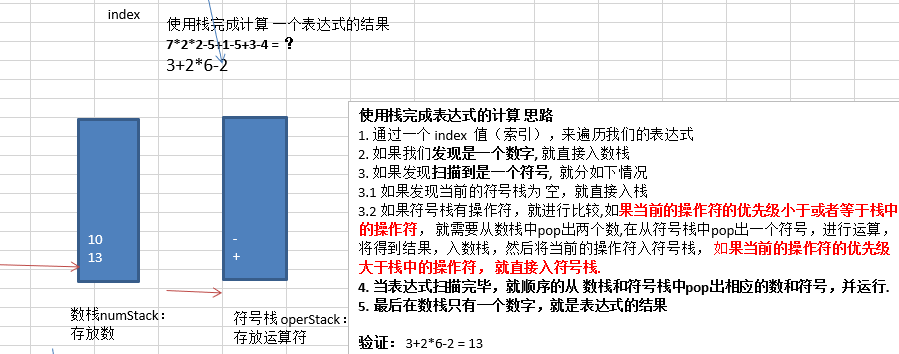

# 4.1使用栈完成计算功能

  

>  **思路分析：**
> 1. 通过一个index索引遍历表达式
> 2. 发现数字，入数字栈
> 3. 发现是符号：
> 	3.1 如果当前的符号栈为空，则直接入栈 
> 	3.2 符号栈不为空，有操作符，则进行比较。当前操作符优先级**小于等于**栈中操作符，则需要从数栈中pop两个数，再从符号栈中pop一个符号，进行运算，并将结果入数字栈，然后将当前操作符入符号栈。
> 	3.3 3.2 符号栈不为空，有操作符，则进行比较。当前操作符优先级**高于**栈中操作符，则直接入符号栈
> 4. 当表达式扫描完毕，就顺序从数栈、符号栈中pop相对应的符号，并运行，最后数栈中只有一个数字，即为最终的结果。

## Java代码实现
```java
package org.example;  
  
import java.util.Stack;  
  
public class Calculator {  
    public static void main(String[] args) {  
        String expression = "70*2*2-5+3-4";  
//        Stack<Integer> numStack = new Stack<Integer>();  
//        Stack<Character> operStack = new Stack<Character>();  
  
        ArrayStack2 numStack = new ArrayStack2(10);  
        ArrayStack2 operStack = new ArrayStack2(10);  
        int index = 0;//扫描索引  
        int num1 = 0;  
        int num2 = 0;  
        int oper = 0;  
        int res = 0;  
        char ch = ' ';//将每次扫描得到的char保存在ch中  
        String keepNum = "";//拼接多位数  
        while (true) {  
            //依次得到expression的字符  
            ch = expression.substring(index, index + 1).charAt(0);  
//            判断ch的值做相应的处理  
            if (operStack.isOper(ch)) {  
                if (!operStack.isEmpty()) {  
                    //符号栈不为空，有操作符，则进行比较。  
                    // 当前操作符优先级**小于等于**栈中操作符，则需要从数栈中pop两个数，  
                    // 再从符号栈中pop一个符号，进行运算，并将结果入数字栈，  
                    // 然后将当前操作符入符号栈。  
                    if (operStack.priority(ch) <= operStack.priority(operStack.peek())) {  
                        num1 = numStack.pop();  
                        num2 = numStack.pop();  
                        oper = operStack.pop();  
                        res = numStack.cal(num1, num2, oper);  
                        numStack.push(res);  
                        operStack.push(ch);  
                    } else {  
//                        当前操作符优先级**高于**栈中操作符，则直接入符号栈  
                        operStack.push(ch);  
                    }  
  
                } else {  
                    operStack.push(ch);  
                }  
            } else {  
//                numStack.push(ch - 48);  
//                1.当处理多位数时，不能立即入栈  
//                2. 处理数时，需要想表达式的index再看一位，如果是数继续扫描，是符号才入栈  
//                3. 定义字符串变量，用于拼接  
                keepNum += ch;  
  
                if (index == expression.length() - 1) {  
                    numStack.push(Integer.parseInt(keepNum));  
                } else {  
//                    判断下一位字符是否为数字  
                    if (operStack.isOper(expression.substring(index + 1, index + 2).charAt(0))) {  
                        numStack.push(Integer.parseInt(keepNum));  
                        keepNum = "";  
                    }  
                }  
//  
            }  
//            index+1,判断是否扫描到最后  
            index++;  
            if (index >= expression.length()) {  
                break;  
            }  
        }  
  
//        当表达式扫描完毕，就顺序从数栈、符号栈中pop相对应的符号，  
//        并运行，最后数栈中只有一个数字，即为最终的结果。  
        while (true) {  
//            符号栈为空，则数栈中只有一个数，最后的结果  
            if (operStack.isEmpty()) {  
                break;  
            }  
            num1 = numStack.pop();  
            num2 = numStack.pop();  
            oper = operStack.pop();  
            res = numStack.cal(num1, num2, oper);  
            numStack.push(res);  
        }  
        System.out.printf("表达式是%s = %s\n", expression, numStack.peek());  
    }  
}  
  
class ArrayStack2 {  
    private int maxSize;  
    private int[] stack;  
    private int top = -1;  
  
    //    构造器  
    public ArrayStack2(int maxSize) {  
        this.maxSize = maxSize;  
        stack = new int[this.maxSize];  
    }  
  
    public boolean isFull() {  
        return top == (maxSize - 1);  
    }  
  
    public boolean isEmpty() {  
        return top == -1;  
    }  
  
    public void push(int value) {  
        if (isFull()) {  
            System.out.println("栈满");  
            return;  
        }  
        top++;  
        stack[top] = value;  
    }  
  
    public int pop() {  
        if (isEmpty()) {  
//            System.out.println("栈空");  
            throw new RuntimeException("栈空");  
        }  
        int value = stack[top];  
        top--;  
        return value;  
    }  
  
    //    遍历时需从栈顶开始显示数据  
    public void list() {  
        if (isEmpty()) {  
            System.out.println("栈空");  
            return;  
        }  
        for (int i = top; i >= 0; i--) {  
            System.out.printf("stack[%d]=%d\n", i, stack[i]);  
        }  
    }  
  
    //返回运算符的优先级  
    public int priority(int oper) {  
        if (oper == '*' || oper == '/') {  
            return 1;  
        } else if (oper == '+' || oper == '-') {  
            return 0;  
        } else {  
            return -1;  
        }  
    }  
  
    public boolean isOper(char val) {  
        return val == '+' || val == '-' || val == '*' || val == '/';  
    }  
  
    public int cal(int num1, int num2, int oper) {  
        int res = 0;  
        switch (oper) {  
            case '+':  
                res = num1 + num2;  
                break;  
            case '*':  
                res = num1 * num2;  
                break;  
            case '-':  
                res = num2 - num1;  
                break;  
            case '/':  
                res = num2 / num1;  
                break;  
            default:  
                break;  
        }  
        return res;  
    }  
  
    public int peek() {  
        return stack[top];  
    }  
}
```