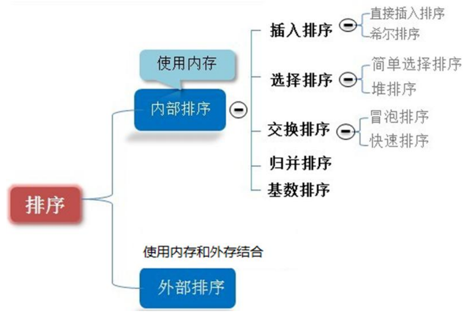

# 排序算法概述

## 1. 引言

在计算机科学领域，排序是一项基础而重要的任务。排序算法用于将一组数据按照一定顺序排列，以提高后续操作的效率。排序算法分为内部排序和外部排序，同时在选择排序算法时需要考虑时间复杂度和空间复杂度。

## 2. 内部排序与外部排序



### 2.1 内部排序

内部排序是指所有排序操作都在内存中完成的过程。常见的内部排序算法有冒泡排序、选择排序、插入排序、归并排序和快速排序等。这些算法适用于数据规模较小、能够一次性加载进内存的情况。

### 2.2 外部排序

外部排序是指涉及到外部存储（通常是硬盘）的排序过程。在这种情况下，数据无法一次性全部加载进内存，需要通过多次访问外部存储来完成排序。外部排序算法包括多路归并排序、置换-选择排序等。

## 3. 常见排序算法

### 3.1 冒泡排序（Bubble Sort）

冒泡排序是一种基础的比较排序算法，它通过多次遍历数组，比较相邻的元素并交换它们的位置，将最大的元素逐步“冒泡”到数组末尾。冒泡排序的时间复杂度为O(n^2)，适用于小规模数据。

```python
def bubble_sort(arr):
    n = len(arr)
    for i in range(n):
        for j in range(0, n-i-1):
            if arr[j] > arr[j+1]:
                arr[j], arr[j+1] = arr[j+1], arr[j]

```

### 3.2 选择排序（Selection Sort）

选择排序是一种简单直观的排序算法，它每次从未排序的部分选择最小的元素，将其放到已排序部分的末尾。选择排序的时间复杂度为O(n^2)，适用于小规模数据。

```python
def selection_sort(arr):
    n = len(arr)
    for i in range(n):
        min_index = i
        for j in range(i+1, n):
            if arr[j] < arr[min_index]:
                min_index = j
        arr[i], arr[min_index] = arr[min_index], arr[i]
```

### 3.3 插入排序（Insertion Sort）

插入排序是一种简单直观的排序算法，将数组分成已排序和未排序两部分，每次从未排序部分选择一个元素插入到已排序部分的合适位置。插入排序的时间复杂度为O(n^2)，适用于小规模数据。

```python
def insertion_sort(arr):
    n = len(arr)
    for i in range(1, n):
        key = arr[i]
        j = i - 1
        while j >= 0 and key < arr[j]:
            arr[j + 1] = arr[j]
            j -= 1
        arr[j + 1] = key
```

### 3.4 归并排序（Merge Sort）

归并排序是一种分治算法，将数组分成两半分别进行排序，然后合并成一个有序序列。归并排序的时间复杂度为O(n log n)，适用于大规模数据。

```python
def merge_sort(arr):
    if len(arr) > 1:
        mid = len(arr) // 2
        left_half = arr[:mid]
        right_half = arr[mid:]

        merge_sort(left_half)
        merge_sort(right_half)

        i = j = k = 0

        while i < len(left_half) and j < len(right_half):
            if left_half[i] < right_half[j]:
                arr[k] = left_half[i]
                i += 1
            else:
                arr[k] = right_half[j]
                j += 1
            k += 1

        while i < len(left_half):
            arr[k] = left_half[i]
            i += 1
            k += 1

        while j < len(right_half):
            arr[k] = right_half[j]
            j += 1
            k += 1
```


### 3.5 快速排序（Quick Sort）

快速排序是一种分治算法，选择一个基准元素，将数组分成比基准小和比基准大的两部分，然后递归地对两部分进行排序。快速排序的平均时间复杂度为O(n log n)，适用于大规模数据。

```python
def quick_sort(arr):
    if len(arr) <= 1:
        return arr
    else:
        pivot = arr[0]
        less = [x for x in arr[1:] if x <= pivot]
        greater = [x for x in arr[1:] if x > pivot]
        return quick_sort(less) + [pivot] + quick_sort(greater)
```

### 3.6 希尔排序（Shell Sort）

希尔排序是插入排序的改进版，通过将数组分成若干个子序列进行插入排序，逐步减小序列的间隔，最终完成排序。希尔排序的时间复杂度为O(n log n)~O(n^2)，适用于中等规模数据。

```python
def shell_sort(arr):
    n = len(arr)
    gap = n // 2
    while gap > 0:
        for i in range(gap, n):
            temp = arr[i]
            j = i
            while j >= gap and arr[j - gap] > temp:
                arr[j] = arr[j - gap]
                j -= gap
            arr[j] = temp
        gap //= 2
```

### 3.8 堆排序（Heap Sort）

堆排序利用二叉堆的性质进行排序，将数组构建成最大堆，然后依次将堆顶元素与末尾元素交换并调整堆，最终完成排序。堆排序的时间复杂度为O(n log n)，适用于大规模数据。

```python
def heapify(arr, n, i):
    largest = i
    left = 2 * i + 1
    right = 2 * i + 2

    if left < n and arr[i] < arr[left]:
        largest = left

    if right < n and arr[largest] < arr[right]:
        largest = right

    if largest != i:
        arr[i], arr[largest] = arr[largest], arr[i]
        heapify(arr, n, largest)

def heap_sort(arr):
    n = len(arr)

    for i in range(n // 2 - 1, -1, -1):
        heapify(arr, n, i)

    for i in range(n - 1, 0, -1):
        arr[i], arr[0] = arr[0], arr[i]
        heapify(arr, i, 0)
```

### 3.9 计数排序（Counting Sort）

计数排序是一种非比较性的排序算法，通过统计每个元素出现的次数，然后进行排序。计数排序的时间复杂度为O(n + k)，其中k为数据范围，适用于整数数据。

```python
def counting_sort(arr):
    max_value = max(arr)
    min_value = min(arr)
    counting_array = [0] * (max_value - min_value + 1)
    sorted_array = [0] * len(arr)

    for num in arr:
        counting_array[num - min_value] += 1

    for i in range(1, len(counting_array)):
        counting_array[i] += counting_array[i - 1]

    for num in reversed(arr):
        index = counting_array[num - min_value] - 1
        sorted_array[index] = num
        counting_array[num - min_value] -= 1

    return sorted_array
```

### 3.11 基数排序（Radix Sort）

基数排序是一种多关键字排序算法，它根据关键字的每一位进行排序。基数排序的时间复杂度为O(n * k)，其中k为关键字的最大位数。

```python
def radix_sort(arr):
    max_value = max(arr)
    exp = 1
    while max_value // exp > 0:
        counting_sort_by_digit(arr, exp)
        exp *= 10

def counting_sort_by_digit(arr, exp):
    n = len(arr)
    counting_array = [0] * 10
    sorted_array = [0] * n

    for num in arr:
        index = num // exp
        counting_array[index % 10] += 1

    for i in range(1, 10):
        counting_array[i] += counting_array[i - 1]

    i = n - 1
    while i >= 0:
        index = arr[i] // exp
        sorted_array[counting_array[index % 10] - 1] = arr[i]
        counting_array[index % 10] -= 1
        i -= 1

    for i in range(n):
        arr[i] = sorted_array[i]
```

### 3.12 桶排序（Bucket Sort）

桶排序是一种将数据分散到多个桶中，每个桶进行单独排序，然后合并的排序算法。桶排序的时间复杂度取决于桶的数量和桶内排序的时间复杂度。

```python
def bucket_sort(arr):
    max_value = max(arr)
    min_value = min(arr)
    bucket_range = (max_value - min_value) / len(arr)

    buckets = [[] for _ in range(len(arr) + 1)]

    for num in arr:
        index = int((num - min_value) / bucket_range)
        buckets[index].append(num)

    sorted_array = []
    for bucket in buckets:
        sorted_array.extend(quick_sort(bucket))

    return sorted_array
```


## 4. 时间复杂度与空间复杂度

### 4.1 时间复杂度

时间复杂度是一种衡量算法运行时间性能的指标，通常使用大O符号表示。不同排序算法的时间复杂度有所不同，常见排序算法的时间复杂度如下：

- 冒泡排序：O(n^2)
- 选择排序：O(n^2)
- 插入排序：O(n^2)
- 归并排序：O(n log n)
- 快速排序：O(n log n)

### 4.2 计算时间复杂度

计算时间复杂度的关键在于确定算法中基本操作的执行次数与输入规模的关系：

- **循环结构：** 对于循环，需要考虑循环的执行次数。例如，一个包含n个元素的数组的线性遍历，时间复杂度为O(n)。
    
- **递归结构：** 对于递归算法，可以使用递归树或主定理来求解时间复杂度。例如，快速排序的平均时间复杂度为O(n log n)。
    
- **嵌套结构：** 当算法中存在嵌套结构时，需要将各个部分的时间复杂度相加。例如，两个嵌套的循环，时间复杂度为O(n^2)。


```python
def example_algorithm(arr):
    n = len(arr)
    
    for i in range(n):          # O(n)
        print(arr[i])
    
    for i in range(n):          # O(n)
        for j in range(n):      # O(n)
            print(arr[i] + arr[j])
```

### 4.3 空间复杂度

空间复杂度是对算法在执行过程中所需存储空间大小的评估。同样使用“大O符号”表示，表示算法所需存储空间的上界。以下是一些建议：

- **常数空间：** 如果算法所需的额外空间是一个常数，空间复杂度为O(1)。
    
- **线性空间：** 如果额外空间随着输入规模线性增长，空间复杂度为O(n)。
    
- **递归空间：** 对于递归算法，递归调用的深度直接影响空间复杂度。

### 4.4 如何计算空间复杂度

计算空间复杂度时，需要考虑算法中所有变量和数据结构的空间占用情况。

```python
```python
def example_algorithm(arr):
    n = len(arr)
    result = 0                # 常数空间
    
    for i in range(n):        # O(1)
        result += arr[i]
    
    temp_array = [0] * n      # 线性空间
    
    for i in range(n):        # O(n)
        temp_array[i] = arr[i]
    
    return result
# 总的空间复杂度为O(1) + O(n) = O(n)。
```

## 5. 总结

排序算法是计算机科学中的核心问题，选择适合特定场景的排序算法对于提高程序性能至关重要。在实际应用中，需要综合考虑排序算法的时间复杂度、空间复杂度以及数据规模等因素，以便选择最优的算法。