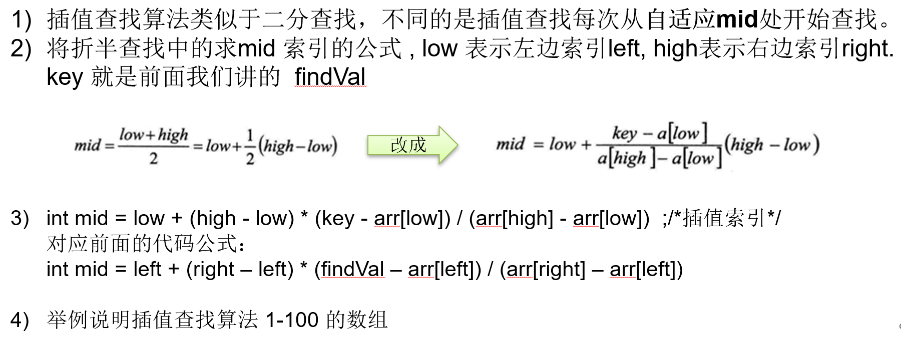

# 常用搜索算法详解

## 1. 顺序（线性）搜索

顺序搜索是一种简单直观的搜索算法，它按顺序逐个检查数组中的元素，直到找到目标元素或遍历整个数组。其时间复杂度为O(n)，适用于小型数据集。

```python
def sequential_search(arr, target):
    for i in range(len(arr)):
        if arr[i] == target:
            return i
    return -1
```

```java
/**  
 * 找到一个满足条件的值就返回  
 *  
 * @param arr  
 * @param value  
 * @return  
 */public static int seqSearch(int[] arr, int value) {  
    for (int i = 0; i < arr.length; i++) {  
        if (arr[i] == value) {  
            return i;  
        }  
    }  
    return -1;  
}
```
## 2. 二分（折半）搜索

> [!Note]
> 前提是**有序**
二分搜索是一种高效的搜索算法，要求数组必须是有序的。它通过不断将目标值与数组中间元素比较，将搜索范围缩小一半，直到找到目标或范围缩小到空集。其时间复杂度为O(log n)。

### 2.1 二分（折半）搜索思路分析

> 1. 首先确定该数组的中见下标 mid = (left + right)/2
> 2. 让需要查找的数findVal与arr[mid]比较
	2.1 findVal > arr[mid] ,  说明你要查找的数在mid 的右边, 因此需要递归的向右查找
	2.2 findVal < arr[mid], 说明你要查找的数在mid 的左边, 因此需要递归的向左查找
	2.3  findVal == arr[mid] 说明找到，就返回

> [!TIP] 递归退出的条件：找到就返回；递归完数组仍然未找到，left>right

### 2.2 代码实现二分（折半）搜索
```python
def binary_search(arr, target):
    low, high = 0, len(arr) - 1
    while low <= high:
        mid = (low + high) // 2
        if arr[mid] == target:
            return mid
        elif arr[mid] < target:
            low = mid + 1
        else:
            high = mid - 1
    return -1
```

```java
public static int binarySearch(int[] arr, int left, int right, int value) {  
  
    //当递归完数组仍然未找到，left>right  
    if (left>right){  
        return -1;  
    }  
    int mid = (left + right) / 2;  
    int midVal = arr[mid];  
    if (value > midVal) {//向右递归  
        return binarySearch(arr, mid + 1, right, value);  
    } else if (value < midVal) {  
        //向左递归  
        return binarySearch(arr, left, mid - 1, value);  
    } else {  
        return mid;  
    }  
}
```

```java
package org.example;  
  
import java.util.ArrayList;  
  
public class BinarySearch {  
    public static void main(String[] args) {  
        int[] arr = {-2, -1, -1, -1, 2, 3, 4, 7};  
        int index = binarySearch(arr, 0, arr.length, 1);  
  
        if (index == -1) {  
            System.out.println("没找到");  
        } else {  
            System.out.println("找到了，下标是" + index);  
        }  
  
        ArrayList<Integer> binarySearch2 = binarySearch2(arr, 0, arr.length, -1);  
        System.out.println(binarySearch2);  
  
    }  
  
    /**  
     * @param arr   数组  
     * @param left  左边索引  
     * @param right 右边索引  
     * @param value 要查找的值  
     * @return 查找到就返回下标，否则返回-1  
     */    public static int binarySearch(int[] arr, int left, int right, int value) {  
  
        //当递归完数组仍然未找到，left>right  
        if (left > right) {  
            return -1;  
        }  
        int mid = (left + right) / 2;  
        int midVal = arr[mid];  
        if (value > midVal) {//向右递归  
            return binarySearch(arr, mid + 1, right, value);  
        } else if (value < midVal) {  
            //向左递归  
            return binarySearch(arr, left, mid - 1, value);  
        } else {  
            return mid;  
        }  
    }  
  
    public static ArrayList<Integer> binarySearch2(int[] arr, int left, int right, int value) {  
  
        //当递归完数组仍然未找到，left>right  
        if (left > right) {  
            return new ArrayList<Integer>();  
        }  
        int mid = (left + right) / 2;  
        int midVal = arr[mid];  
        if (value > midVal) {//向右递归  
            return binarySearch2(arr, mid + 1, right, value);  
        } else if (value < midVal) {  
            //向左递归  
            return binarySearch2(arr, left, mid - 1, value);  
        } else {  
//            return mid;  
            //找到mid值时，不立刻返回。  
            //先向mid索引值左边扫描，将所有满足的元素下标加入到集合中  
            //先向mid索引值右边扫描，将所有满足的元素下标加入到集合中  
            //返回ArrayList  
            ArrayList<Integer> resIndexList = new ArrayList<>();  
            int temp = mid - 1;  
            while (true) {  
                if (temp < 0 || arr[temp] != value) {  
                    break;  
                }  
                resIndexList.add(temp);  
                temp -= 1;  
            }  
            resIndexList.add(mid);  
  
            temp = mid + 1;  
            while (true) {  
                if (temp > arr.length - 1 || arr[temp] != value) {  
                    break;  
                }  
                resIndexList.add(temp);  
                temp += 1;  
            }  
            return resIndexList;  
        }  
  
    }  
}
```

## 3. 插值搜索

### 3.1 插值搜索介绍

插值搜索是一种改进的二分搜索算法，特别适用于数据分布均匀的有序数组。它通过目标值在数组中的大致位置估计，从而更快地缩小搜索范围。插值搜索的时间复杂度与二分搜索类似，也是O(log n)。

> [!TIP] 思路：插值搜索的核心原理是根据目标值在数组中的估计位置，通过插值公式动态调整搜索范围。它假设数据分布较均匀，因此在估计目标位置时更为准确。

### 3.2 插值搜索步骤



1. 初始化搜索范围的低位（low）和高位（high）。
2. 计算当前猜测值（mid）使用插值公式：`mid = low + (target - arr[low]) * (high - low) // (arr[high] - arr[low])`。
3. 比较arr[mid]与目标值的大小关系。
4. 根据比较结果更新搜索范围。
5. 重复以上步骤直到找到目标值或搜索范围为空。

### 3.3 代码实现插值搜索

```python
def interpolation_search(arr, target):
    low, high = 0, len(arr) - 1
    while low <= high and arr[low] <= target <= arr[high]:
        mid = low + (target - arr[low]) * (high - low) // (arr[high] - arr[low])
        if arr[mid] == target:
            return mid
        elif arr[mid] < target:
            low = mid + 1
        else:
            high = mid - 1
    return -1
```

```java
package org.example;  
  
import java.util.Arrays;  
  
public class InsertValueSearch {  
    public static void main(String[] args) {  
        int[] arr = new int[100];  
  
        for (int i = 0; i < 100; i++) {  
            arr[i] = i + 1;  
        }  
//        System.out.println(Arrays.toString(arr));  
        int index = insertValueSearch(arr, 0, arr.length-1, 78);  
        System.out.println("下标是：" + index);  
    }  
  
    public static int insertValueSearch(int[] arr, int left, int right, int findVal) {  
        if (left > right || findVal < arr[0] || findVal > arr[arr.length - 1]) {  
            return -1;  
        }  
  
        int mid = left + (right - left) * (findVal - arr[left]) / (arr[right] - arr[left]);  
        int midVal = arr[mid];  
        if (findVal > midVal) {//向右递归  
            return insertValueSearch(arr, mid + 1, right, findVal);  
        } else if (findVal < midVal) {  
            //向左递归  
            return insertValueSearch(arr, left, mid - 1, findVal);  
        } else {  
            return mid;  
        }  
    }  
}
```

## 4. 斐波那契搜索

斐波那契搜索是一种对有序数组进行搜索的算法，结合了二分搜索和黄金分割的思想。它通过斐波那契数列来确定分割点，从而减少比较次数。其时间复杂度为O(log n)。

```python
def fibonacci_search(arr, target):
    fib_m_minus_2, fib_m_minus_1 = 0, 1
    fib = fib_m_minus_1 + fib_m_minus_2

    while fib < len(arr):
        fib_m_minus_2, fib_m_minus_1 = fib_m_minus_1, fib
        fib = fib_m_minus_1 + fib_m_minus_2

    offset = -1
    while fib > 1:
        i = min(offset + fib_m_minus_2, len(arr) - 1)

        if arr[i] < target:
            fib = fib_m_minus_1
            fib_m_minus_1 = fib_m_minus_2
            fib_m_minus_2 = fib - fib_m_minus_1
            offset = i

        elif arr[i] > target:
            fib = fib_m_minus_2
            fib_m_minus_1 -= fib_m_minus_2
            fib_m_minus_2 = fib - fib_m_minus_1

        else:
            return i

    if fib_m_minus_1 and arr[offset + 1] == target:
        return offset + 1

    return -1
```

通过了解这四种常用的搜索算法，我们能够更好地选择适合特定场景的算法，提高搜索效率。在实际应用中，根据数据特点选择合适的搜索算法是提高程序性能的关键。