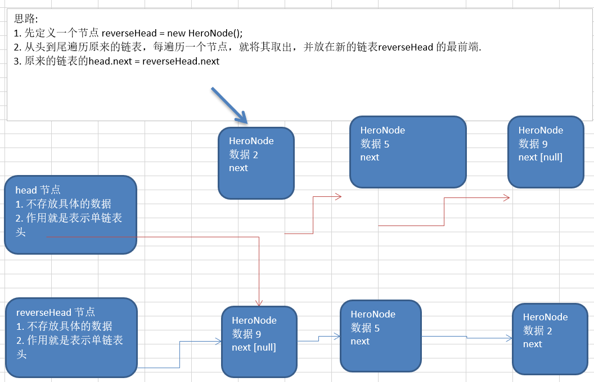

# 单链表反转：改变链的方向

单链表反转是一种常见而重要的链表操作，它可以改变链表的方向，使得原先的尾节点成为新的头节点。

## 1. 单链表反转的基本原理

单链表反转的核心思想是通过改变节点之间的链接方向，将链表的尾部连接到头部。这个操作可以通过遍历链表并逐个调整节点的 next 指针来实现。

## 2. Python单链表反转的实现方式

### 2.1 迭代法

迭代法是一种直观而简单的实现方式，通过遍历链表，逐个改变节点的 next 指针方向。以下是一个使用迭代法的示例（使用Python）：

```python
class ListNode:
    def __init__(self, value=0, next=None):
        self.value = value
        self.next = next

def reverse_linked_list(head):
    prev = None
    current = head

    while current is not None:
        next_node = current.next
        current.next = prev
        prev = current
        current = next_node

    return prev

# 示例使用
head = ListNode(1, ListNode(2, ListNode(3, ListNode(4, ListNode(5)))))
reversed_head = reverse_linked_list(head)

# 输出反转后的链表
current = reversed_head
while current is not None:
    print(current.value, end=" -> ")
    current = current.next
print("None")
```

### 2.2 递归法

递归法是一种更为巧妙的实现方式，通过递归地反转子链表，并调整当前节点的指针。以下是一个使用递归法的示例（使用Python）：

```python
def reverse_linked_list_recursive(head):
    if head is None or head.next is None:
        return head

    new_head = reverse_linked_list_recursive(head.next)
    head.next.next = head
    head.next = None

    return new_head

# 示例使用
head = ListNode(1, ListNode(2, ListNode(3, ListNode(4, ListNode(5)))))
reversed_head_recursive = reverse_linked_list_recursive(head)

# 输出递归反转后的链表
current = reversed_head_recursive
while current is not None:
    print(current.value, end=" -> ")
    current = current.next
print("None")
```

## 3. Java单链表反转的实现方式



> 实现思路：
> 1. 先定义一个节点 reverseHead = new HeroNode();
> 2. 从头到尾遍历，每遍历一个节点就将其取出并放在新链表的最前端
> 3. 原来的链表head.next = reverseHead.next

```java
package org.example;  
  
import static org.example.SinglelinkedList.*;  
  
public class SingleLinkedListDemo {  
    public static void main(String[] args) {  
        HeroNode heroNode1 = new HeroNode(1, "一号", "1号");  
  
        HeroNode heroNode2 = new HeroNode(2, "二号", "2号");  
  
        HeroNode heroNode3 = new HeroNode(3, "三号", "3号");  
  
        HeroNode heroNode4 = new HeroNode(4, "四号", "4号");  
  
        HeroNode heroNode5 = new HeroNode(4, "五号", "5号");  
  
        HeroNode heroNode6 = new HeroNode(6, "六号", "6号");  
  
//        创建链表  
        SinglelinkedList singlelinkedList = new SinglelinkedList();  
//        加入  
        singlelinkedList.add(heroNode1);  
        singlelinkedList.add(heroNode2);  
        singlelinkedList.add(heroNode3);  
        singlelinkedList.add(heroNode4);  
  
        singlelinkedList.list();  
        singlelinkedList.del(heroNode3);  
        singlelinkedList.list();  
        System.out.println("有效的节点个数：" + getLength(singlelinkedList.getHead()));  
  
        singlelinkedList.addByOrder(heroNode5);  
        singlelinkedList.addByOrder(heroNode6);  
        singlelinkedList.addByOrder(heroNode3);  
        singlelinkedList.list();  
  
//        HeroNode res = findLastIndexNode(singlelinkedList.getHead(), 2);  
//        System.out.println(res);  
        System.out.println("反转单链表-------");  
        reverseList(singlelinkedList.getHead());  
        singlelinkedList.list();  
    }  
}  
  
//定义SingleLinkedList来管理角色  
class SinglelinkedList {  
  
    //返回头节点  
    public HeroNode getHead() {  
        return head;  
    }  
  
    //    初始化头节点，不动头节点  
    private HeroNode head = new HeroNode(0, "", "");  
  
    public void add(HeroNode heroNode) {  
        //    添加节点搭配单向链表  
        //    思路：不考虑编号顺序时，  
        //    找到当前链表的最后节点，并将其next指向新的节点  
        HeroNode temp = head;  
//        遍历链表，找到最后一个  
        while (true) {//退出循环时，temp指向最后  
            if (temp.next == null) {  
                break;  
            }  
            temp = temp.next;  
        }  
        temp.next = heroNode;  
    }  
  
    public void addByOrder(HeroNode heroNode) {  
        HeroNode temp = head;  
//        temp位于添加的前一个节点  
        boolean flag = false;//添加的编号是否存在  
        while (true) {  
            if (temp.next == null) {//处在链表最后  
                break;  
            }  
            if (temp.next.no > heroNode.no) {//位置找到了  
                break;  
            } else if (temp.next.no == heroNode.no) {  
                flag = true;//说明编号存在  
                break;  
            }  
            temp = temp.next;  
        }  
//        判断flag  
        if (flag) {  
            System.out.println("准备插入的编号已经存在,不能加入");  
        } else {  
            //添加到链表中  
            heroNode.next = temp.next;  
            temp.next = heroNode;  
        }  
    }  
  
    //    根据no修改节点的信息  
    public void update(HeroNode heroNode) {  
//        判断是否为空  
        if (heroNode.next == null) {  
            System.out.println("链表为空");  
            return;  
        }  
        //找到需要修改的节点,根据no修改.遍历  
        HeroNode temp = head.next;  
        boolean flag = false;  
        while (true) {  
            if (temp.next == null) {  
                break;  
            }  
            if (temp.no == heroNode.no) {  
                flag = true;  
                break;  
            }  
            temp = temp.next;  
        }  
        if (flag) {  
            temp.nickname = heroNode.nickname;  
            temp.name = heroNode.name;  
        } else {  
            System.out.println("未找到编号");  
        }  
    }  
  
    public void del(HeroNode heroNode) {  
        //        判断是否为空  
        if (heroNode.next == null) {  
            System.out.println("链表为空");  
            return;  
        }  
        HeroNode temp = head.next;  
        boolean flag = false;  
        while (true) {  
            if (temp.next == null) {  
                break;  
            }  
            if (temp.next.no == heroNode.no) {  
                flag = true;  
                break;  
            }  
            temp = temp.next;  
        }  
        if (flag) {  
            temp.next = temp.next.next;  
        } else {  
            System.out.println("要删除的不存在");  
        }  
    }  
  
    /**  
     * @param head 链表头节点  
     * @return 返回有效节点的个数  
     */  
    //获取单链表有效节点的个数（带头节点需要不统计头节点）  
    public static int getLength(HeroNode head) {  
        if (head.next == null) {  
            return 0;  
        }  
        int length = 0;  
  
//        定义辅助节点，不统计头节点  
        HeroNode cur = head.next;  
        while (cur != null) {  
            length++;  
            cur = cur.next;  
        }  
        return length;  
    }  
  
    //查找单链表的倒数第k个节点\  
//    1.编写方法接受head节点，同时接收index表示倒数第index个节点  
//    2.先把链表从头到尾遍历，length-index  
    public static HeroNode findLastIndexNode(HeroNode head, int index) {  
        if (head.next == null) {  
            return null;  
        }  
//        第一次遍历，得到链表长度  
        int length = getLength(head);  
//        第二次遍历length-index  
        if (index <= 0 || index > length) {  
            return null;  
        }  
        HeroNode temp = head.next;  
        for (int i = 0; i < length - index; i++) {  
            temp = temp.next;  
        }  
        return temp;  
    }  
  
    public static void reverseList(HeroNode head) {  
        if (head.next == null || head.next.next == null) {  
            return;  
        }  
        HeroNode cur = head.next;  
        HeroNode next = null;  
        HeroNode reverseHead = new HeroNode(0, "", "");  
//        遍历原来的链表  
        while (cur != null) {  
            next = cur.next;  
            cur.next = reverseHead.next;  
            reverseHead.next = cur;  
            cur = next;  
        }  
        head.next = reverseHead.next;  
    }  
  
    //    显示链表  
    public void list() {  
//        先判断链表是否为空  
        if (head.next == null) {  
            System.out.println("链表为空");  
            return;  
        }  
//        因为头节点不能动，因此需要辅助变量进行遍历  
        HeroNode temp = head.next;  
        while (true) {  
            if (temp == null) {  
                return;  
            }  
//            输出节点信息|  
            System.out.println(temp);  
//            temp后移  
            temp = temp.next;  
        }  
    }  
}  
  
  
//定义HeroNode,每个HeroNode对象就是一个节点  
class HeroNode {  
    public int no;  
    public String name;  
    public String nickname;  
    public HeroNode next;  
  
    //    构造器  
    public HeroNode(int no, String name, String nickname) {  
        this.name = name;  
        this.no = no;  
        this.nickname = nickname;  
    }  
  
    @Override  
    public String toString() {  
        return "HeroNode{" +  
                "no=" + no +  
                ", name='" + name + '\'' +  
                ", nickname='" + nickname + '\'' +  
                '}';  
    }  
}
```

## 4. 单链表反转的应用场景

### 4.1 数据库查询结果

在数据库查询结果返回时，常常使用链表结构，而在前端或后端中，可能需要反转链表以满足特定需求。

### 4.2 链表栈

在实现链表栈时，有时需要将栈的顺序反转，以便于一些特定操作。

## 5. 总结

单链表反转是一种常见而基础的链表操作，通过改变节点之间的链接方向，使得链表的尾部变为新的头部。实现方式有迭代法和递归法，各有特点。